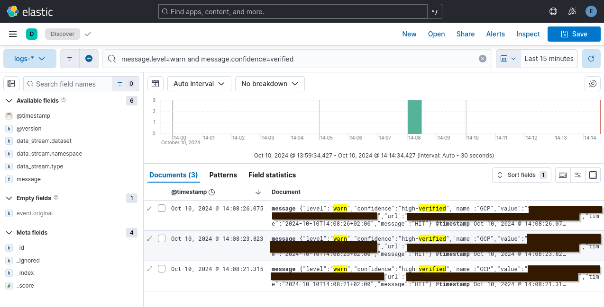

### ELK Integration

To easily analyze the results you can [redirect the pipeleak](https://github.com/deviantony/docker-elk?tab=readme-ov-file#injecting-data) output using `nc` into Logstash.

Setup a local ELK stack using https://github.com/deviantony/docker-elk. 

Then you can start a scan:
```bash
pipeleak gl scan --token glpat-[redacted] --gitlab https://gitlab.example.com  --json | nc -q0 localhost 50000
```

Using Kibana you can filter for interesting messages, based on the JSON attributes of the output.

e.g. `message.level=warn and message.confidence=verified` to find verified results.

