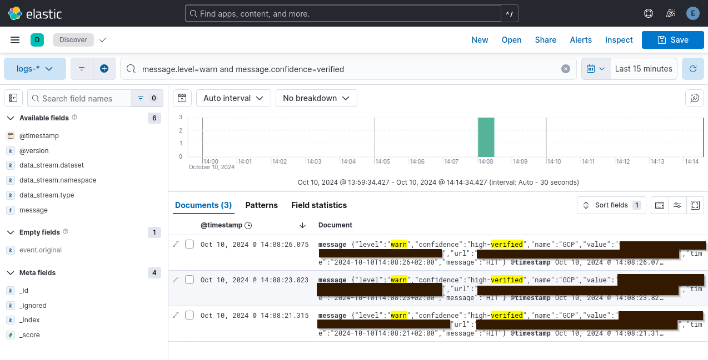

<p align="center">
  
</p>


# Pipeleak

Pipeleak is a tool designed to scan CI/CD logs and artifacts for secrets.

It supports the following platforms:
* GitLab
* GitHub
* BitBucket
* Azure DevOps

## Getting Started

To begin using Pipeleak, download the latest binary from the [Releases](https://github.com/CompassSecurity/pipeleak/releases) page.

### General Usage

Run the following command to scan your e.g. GitLab instance:

```bash
pipeleak gl scan --token glpat-xxxxxxxxxxx --gitlab https://gitlab.com
```

### Scanning Artifacts

In addition to logs, Pipeleak can also scan artifacts generated by your pipelines.

Note: Scanning artifacts uses a lot of memory!
```bash
pipeleak gl scan --token glpat-xxxxxxxxxxx --gitlab https://gitlab.com -a 
```
### Confidence

The following confidence levels for scans are used by default:
* `low`
* `medium`
* `high`
* `high-verified` these are validated by the corresponding TruffleHog validator.

However if you want to add custom ones, you can define any value in the `rules.yml` file
To scan only for a specific level, you can specify it via CLI flag e.g `--confidence=high,medium`. Define multiple by comma separating the values.

Note: `high-verified` cannot be removed, but verification can be disabled using `--truffleHogVerification=false`.

### Customizing Scan Rules

When you run Pipeleak for the first time, it generates a `rules.yml` file based on [this repository](https://github.com/mazen160/secrets-patterns-db/blob/master/db/rules-stable.yml). You can customize your scan rules by modifying this file as needed.

### Keybindings

In the `scan` mode you can change interactively between log levels by pressing `t`: Trace, `d`: Debug, `i`: Info, `w`: Warn, `e`: Error. Pressing `s` will output the current queue status.

# Platform Specific Hints

## GitLab

### Dotenv

[Dotenv artifacts](https://docs.gitlab.com/ee/ci/yaml/artifacts_reports.html#artifactsreportsdotenv) are not accessible through the GitLab API. To scan these, you need to manually provide your session cookie after logging in via a web browser. The session cookie name is `_gitlab_session`. The cookie should be valid for [two weeks](https://gitlab.com/gitlab-org/gitlab/-/issues/395038).

```bash
pipeleak gl scan --token glpat-xxxxxxxxxxx --gitlab https://gitlab.com -v -a -c [value-of-valid-_gitlab_session]
```

### Memory Usage

As the scanner processes a lot of resoures (especially when using  `--artifacts`) memory, CPU and disk usage can become hard to manage. 
You can tweak `--threads`, `--max-artifact-size` and `--job-limit` to obtain a customized performance and achieve stable processing.

### Additional Features

`shodan` command: use the Shodan command to identify gitlab instances that might allow for anyone to register. this command assumes a JSON file from a Shodan export. example query: `product:"GitLab Self-Managed"`

`runners` command: Identify (shared) runners which are available globally or through a group where the user has at least developer access. Create projects with a default exploitation `.gitlab-ci.yml` file.

`register` command: Best effort automation to register a new user on an instance.

`vuln` command: Check the installed version for CVEs in the NIST Vulnerability database

`variables` command: Enumerate configured project/group/instance variables

`secureFiles` command: Enumerate secure files

`enum` command: Enumerate user permissions and accesss

`renovate enum` command: Enumerate Renovate configurations including [Autodiscovery](https://blog.compass-security.com/2025/05/renovate-keeping-your-updates-secure/) configuration. Use `-v` to print CI/CD config.

`renovate autodiscovery` command: Exploit vulnerable Renovate autodisovery configurations. Creates a PoC repo.

`renovate privesc` command: Inject a malicious CI/CD Job into the protected default branch abusing Renovate Bot's access and [Auto-Merge](https://blog.compass-security.com/2025/05/renovate-keeping-your-updates-secure/).

`cicd yaml` command: Fetch full CI/CD Yaml configuration (compiles all references)

### GitLab Proxy Support

> **Note:** Proxying is currently supported only for GitLab commands.

Since Go binaries aren't compatible with Proxychains, you can set a proxy using the HTTP_PROXY environment variable.

For HTTP proxy (e.g., Burp Suite):
```bash
HTTP_PROXY=http://127.0.0.1:8080 pipeleak gl scan --token glpat-xxxxxxxxxxx --gitlab https://gitlab.com
```

For SOCKS5 proxy:
```bash
HTTP_PROXY=socks5://127.0.0.1:8080 pipeleak gl scan --token glpat-xxxxxxxxxxx --gitlab https://gitlab.com
```

## GitHub

Scan owned repositories including their artifacts
```bash
pipeleak gh scan --token github_pat_xxxxxxxxxxx --artifacts --owned
```

Scan repositories of an organization
```bash
pipeleak gh scan --token github_pat_xxxxxxxxxxx --artifacts --maxWorkflows 10 --org apache
```

Scan public repositories
```bash
pipeleak gh scan --token github_pat_xxxxxxxxxxx --artifacts --maxWorkflows 10 --public
```

Scan by search term
```bash
pipeleak gh scan --token github_pat_xxxxxxxxxxx --artifacts --maxWorkflows 10 --search iac
```

Scan repositories of a user
```bash
pipeleak gh scan --token github_pat_xxxxxxxxxxx --artifacts --user firefart
```

## BitBucket

> To scan artifacts internal APIs are called. Thus you need to extract the session cookie value `cloud.session.token` from https://bitbucket.org using your browser and supply it in the -c flag.

Scan your owned repositories and their artifacts
```bash
pipeleak bb scan -t xxxxxxxxxxx -c eyJxxxxxxxxxxx -u auser --owned --artifacts
```

Scan a workspace (find public ones here: https://bitbucket.org/repo/all/) without artifacts
```bash
pipeleak bb scan --token xxxxxxxxxxx --username auser --workspace bitbucketpipelines
```

Scan all public repositories without their artifacts
> If using `after`, the API becomes quite unreliable 👀
```bash
pipeleak bb scan --token xxxxxxxxxxx --username auser --public --maxPipelines 5 --after 2025-03-01T15:00:00+00:00
```

## Azure DevOps

Scan all pipelines the current user has access to
```bash
pipeleak ad scan --token xxxxxxxxxxx --username auser --artifacts
```

Scan all pipelines of an organization
```bash
pipeleak ad scan --token xxxxxxxxxxx --username auser --artifacts --organization myOrganization
```

Scan all pipelines of a project e.g. https://dev.azure.com/PowerShell/PowerShell
```bash
pipeleak ad scan --token xxxxxxxxxxx --username auser --artifacts --organization powershell --project PowerShell
```

### Authentication
Create your PAT here: https://dev.azure.com/{yourproject}/_usersSettings/tokens

> In the top right corner you can choose the scope (Global, Project etc.). 
> Global in that case means per tenant. If you have access to multiple tentants you need to run a scan per tenant.
> Get you username from an HTTPS git clone url from the UI.


# ELK Integration

To easily analyze the results you can [redirect the pipeleak](https://github.com/deviantony/docker-elk?tab=readme-ov-file#injecting-data) output using `nc` into Logstash.

Setup a local ELK stack using https://github.com/deviantony/docker-elk. 

Then you can start a scan:
```bash
pipeleak gl scan --token glpat-xxxxxxxxxxx --gitlab https://gitlab.com  --json | nc -q0 localhost 50000
```

Using Kibana you can filter for interesting messages, based on the JSON attributes of the output.

e.g. `message.level=warn and message.confidence=verified` to find verified results.


